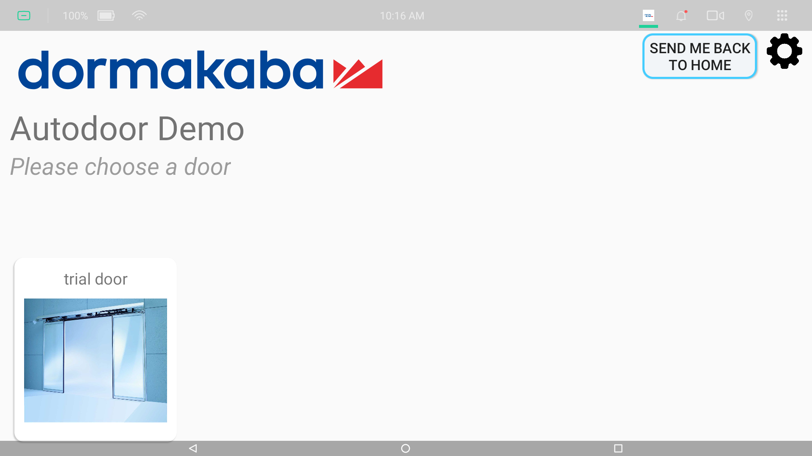
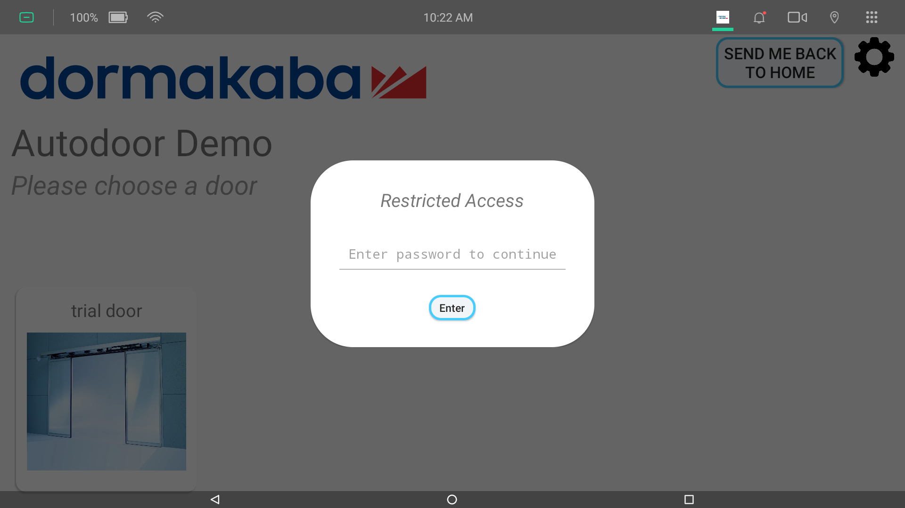
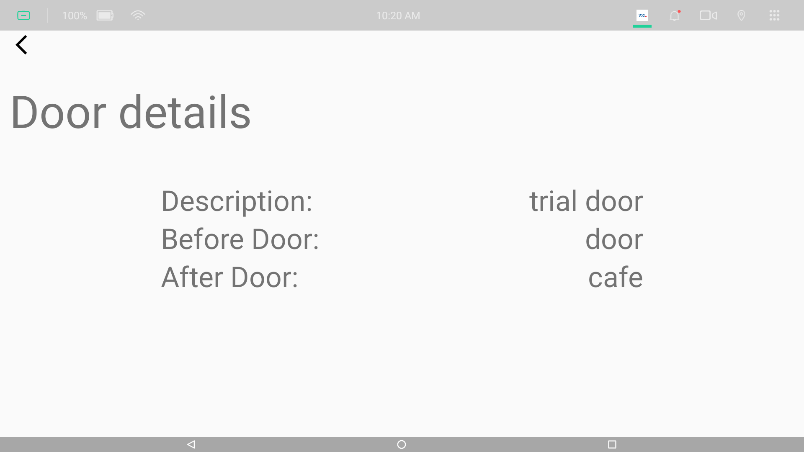
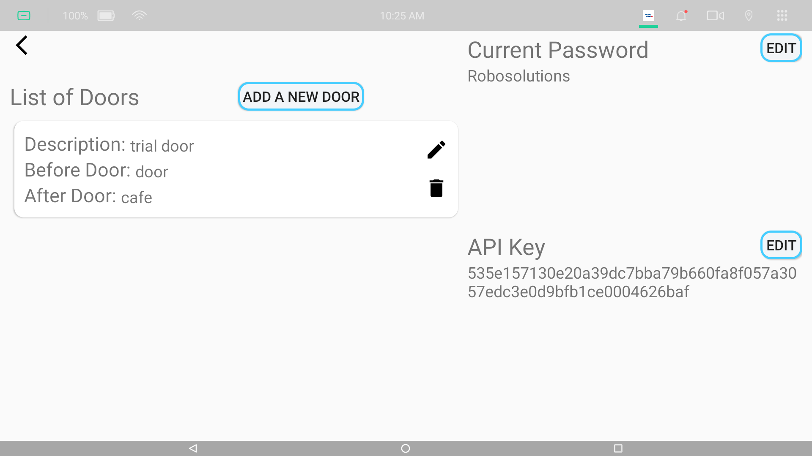
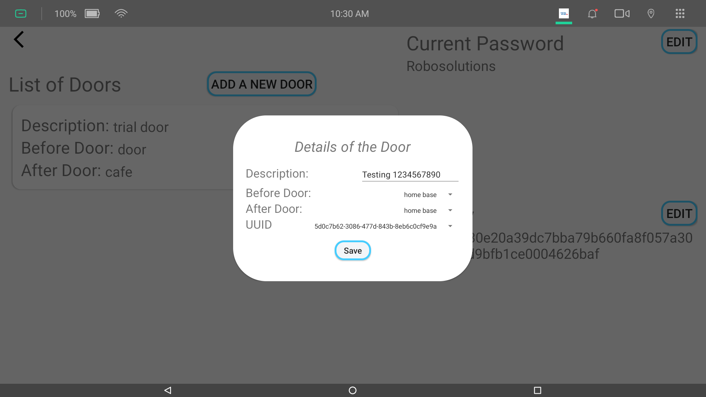
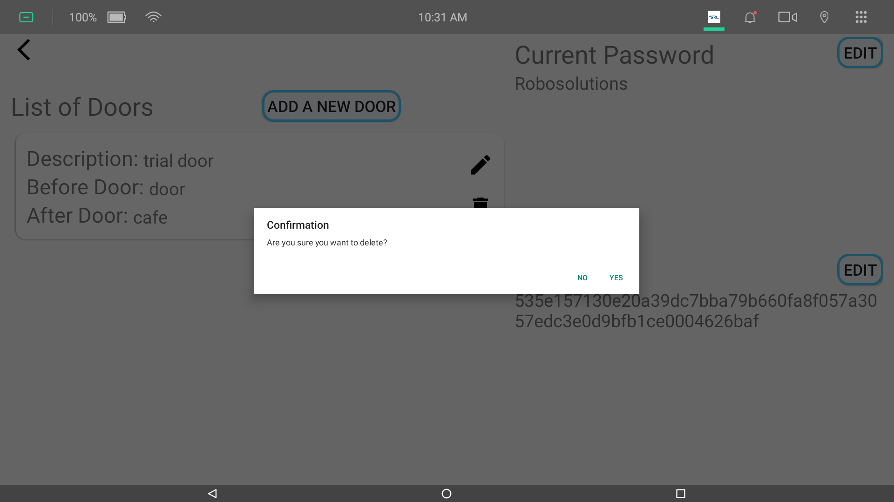

# Dormakaba-Demo

## Main Screen

You can choose a door shown at the bottom to start the demonstration. Clicking on it will bring you to [Go To Door Screen](#go-to-door-screen).

There are 2 buttons on the top right corner.

* `Send Me Back To Home` button sends temi back to the `Home Base`.
* The `Setting` icon button will bring up the login dialog. On successful login, you will enter [Setting Screen](#setting-screen).
  

## Go To Door Screen

The current flow of the demonstration is as follows:

1. Check for door status.
   * End if `doorState` is `OFFLINE`.
1. Check for door error.
   * End if `errors[0]` is **not** `NO_ERROR`.
1. Go to `Before Door` location.
1. Open the door with `holdOpen`.
1. Go to `After Door` location when `doorState` is `openOHZ`.
1. Close the door.
1. Open the door again after a delay.
1. Go to `Before Door` location when `doorState` is `openOHZ` without rotation on arrival (so temi will face away from the door).
1. End of demonstration, go back to [Main Screen](#main-screen).

There are speech that temi will say, indicating the current status of the demonstration.

## Setting Screen

You can edit the password or the API key here.

* The default password is `Robosolutions`.
* The default API key is `535e157130e20a39dc7bba79b660fa8f057a3057edc3e0d9bfb1ce0004626baf` (provided by Dormakaba for us to test)

You can click on `Add A New Door` to add a new door.

* `Before and after door` locations **cannot** be the same.
* The locations are taken from the locations stored in temi's map.
* Preferbally, `before  and after door` locations should both be facing the door, when saved in temi's map.
* The `UUID` field fetches from the server the list of `UUIDs` provided by Dormakaba.
  * While it is fetching, you **cannot** save the door details.
  * While it is fetching, you can edit the description, and choose the before and after door locations.

You can click on the `Edit` icon to edit an existing door.

You can click on the `Delete` icon to delete an existing door.

* A confirmation dialog will appear to double confirm that you are deleting.
* The process is irreversible.
* 
