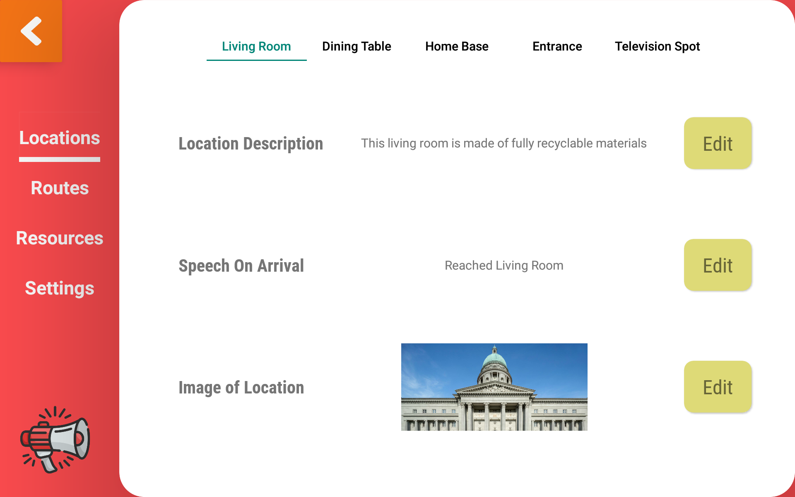

# Temi Announcer
Temi Announcer is a versatile application that announces customised speeches upon arrival at a location.

Routes can be created in Temi Announcer with selected locations, and they can be configured to announce speeches upon 
arrival at each location.

If you prefer to announce the same speech at specific locations (and do this repeatedly), Temi Announcer offers Patrol Routes
as a solution.

## Why should I use Temi Announcer?

Perhaps you are a business owner and you would like to offer visitors who enter your physical store/facility a service that can bring them
to a location of their choice? Temi Announcer allows you to add a description and an image to a location saved in temi, so that
visitors have a better idea of where to go, and they can select that location for temi to escort them there.

Perhaps you manage a hospital, and you would like the nurses to go to specific wards/beds to inform patients on something. 
Temi Announcer allows you to create Patrol Routes, which can announce the same message at selected locations, and optionally do
this task repeatedly.

## Interested to know more? Head over here for the full User Guide

Icons made by <a href="" title="wanicon">wanicon</a> from <a href="https://www.flaticon.com/" title="Flaticon">www.flaticon.com</a>

