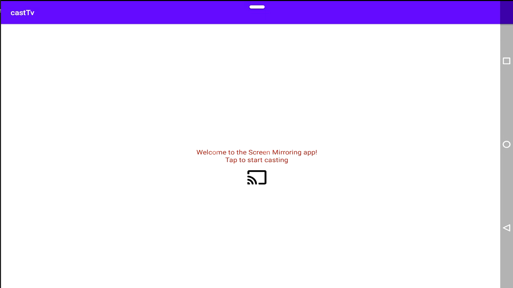
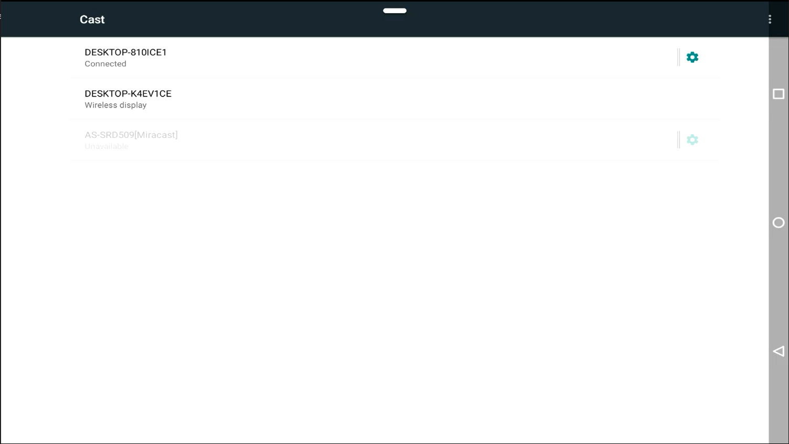

<!-- Heading--->
# castTv
<!-- Heading 2 -->
## About
This app allows temi to mirror its screen to any device that supports Miracast and Chromecast. The use cases are for during demo or tutorial sessions where casting Temi's screen on a larger screen makes the learning process better

## App Configurations
**The device to be casted on should either support ChromeCast or MiraCast. This can either be built-in inside a smartTV or via a ChromeCast/MiraCast Dongle**

## Casting

Press the central button on the screen to start the casting session

Nearby devices that have ChromeCast/MiraCast enabled will appear on the screen. Select the relevant one and the screen casting session will begin

