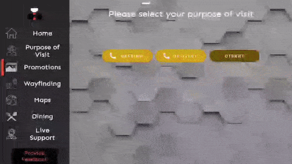

<!-- Heading--->

# TemiConcierge

## What is TemiConcierge? 
TemiConcierge is a highly configurable application that utilises temi's capabilities to provide concierge services to users.

---
## Is there anything I need to do before using TemiConcierge?
1. Allow temi to track users so that TemiConcierge can greet users that temi detects.
   > Settings > General Settings > Tracking User > ON
2. Turn off the screen that appears when temi travels to a location
   > Settings > General Settings > Fullscreen navigation notification > OFF

---
# Overview

## "Sign In" screen
Google Drive account that will be associated with the application.
  

## "Main" screen
The screen where users will interact with TemiConcierge. It has several tabs, each with its own function, and all of them
can be configured to be hidden/shown(default), except for the "Home" tab.

## "Configuration" screen
The screen where only the "administrators" of the temi are able to access, so as to configure the application. To enter this screen,
click the app's logo in the "Main" screen 3 times, and enter the password.

The default password is **Robosolutions**

---
## Tabs under "Main" screen

### "Home" tab
On this tab, slides (images only) can be shown. To configure these slides, you will have to go to the home slides option under the
"General" tab in the "Configuration" screen.
  

### "Purpose of Visit" tab
On this tab, users can select 3 options to call the relevant person based on the purpose of their visit.
* Meeting
* Delivery
* Others
  

If the "Others" option is selected, the relevant person shown (only one) is the "Human Assistant". The assistant can be configured under
  the "Personnel" tab in the "Configuration" screen. The default human assistant is the owner of the temi robot. 
All users added to this temi will be available (shown) to call for the "Meeting" option, and this cannot be changed. 
However, the users of this temi can be (individually) configured to be unavailable for calling, for the "Delivery" option.
  
### "Promotions" tab
On this tab, images and videos can be shown to the user upon clicking them. For images, they have the option to be accompanied by a speech that 
temi will announce once the image is opened. This can be done in the "Resources" tab in the "Configuration" screen.
  

### "Wayfinding" tab
On this tab, users can select a location **(refers to locations that are mapped in temi)** for temi to escort them to, before it returns to home base.
Users can click any of the other locations while temi is move to the newly selected location instead.

### "Maps" tab
On this tab, there are 3 different functions available to users:

1. Interactive Map
2. Taxi
3. Directions to pre-configured destinations **(NOT the same as locations mapped in temi)**

Interactive Map allows users to view an online map. When the button is clicked, a dialog will appear where TemiConcierge opens the pre-configured URL to the online map.
The URL can be edited under the "Others" tab of the "Configuration" screen, and under the same tab will administrators be able to hide the "Interactive Map" button.
  

Taxi helps users to hire a cab. On clicking the "Taxi" button, information is shown on the various companies that offer cab services, that can be configured in the "Taxi"
tab in the "Configuration" screen. Either a hotline number of the company or a QR code that opens the company's app on the user's phone is given. The taxi button can also be
hidden under the "Others" tab of the "Configuration" screen.
  

Users might also want general directions on how to get to nearby places **(NOT to be confused with locations mapped in temi)**. When such a place is selected in the "Maps" tab,
a dialog appears, showing an image of the place, as well as instructions on how to get to the place. temi will narrate the instructions when the dialog appears. Directions to
pre-configured destinations can be configured under the "Directions" tab of the "Configuration" screen.
  

### "Dining" tab
On this tab, users are presented with pre-configured dining recommendations around the vicinity.

Each dining recommendation has a category which can be used to filter those that show up on the screen. A dining recommendation can have up to 5 images that represents it, up to 3 food
items that it is known for, and also has an address. Adding, editing and deleting of dining recommendations are all done under the "Dining" tab of the "Configuration" screen. 
  

### "Live Support" tab
On this tab, users can select who to call over temi (e.g Customer Service, Security etc), provided the person they are calling are users of this temi robot under the temi
app. By default, all users of this temi robot **(NOT to be confused with users of TemiConcierge)** can be called under this tab, and this can be configured under the "Personnel" tab
of the "Configuration" screen.
  

### "Provide Feedback" tab
On this tab, users can scan a QR code to do surveys/feedback forms. Adding/removing this QR code can be done under the "General" tab of the "Configuration" screen.
  

---
## Tabs under "Configuration" screen

### "General" tab
On this tab, you can: 
1. Change the password to enter the "Configuration" screen.
2. Change the greeting message that is announced when temi detects a user in front of it (in TemiConcierge)
3. Insert the QR code image that is shown
4. Edit the slides to be shown in the "Home" tab of the "Main" screen.
5. Edit temi's detection distance in TemiConcierge.
6. Sign out of the currently used Google account.

For (4), the slides can be reordered by dragging and dropping. 
For (5), it is not recommended to set the distance to either 0.5m or 2m.

### Personnel Tab
On this tab, you can: 
1. Change the mode of calling each user added to this temi (Mobile or Computer).
2. Change the human assistant.
3. Change the users of this temi that are available for calls regarding delivery purposes. These users will be displayed in the dialog when
    the "Meeting" button is selected under the "Purpose of Visit" tab of the "Main screen"
4. Change the users of this temi that are displayed under the "Live Support" tab of the "Main" screen.

For (1), the default mode is Mobile. 
For (2), the default human assistant is the owner of this temi (In the temi app, if the owner's name is xyz, this temi will appear as "xyz's temi"). 
For (3) and (4), all users of this temi are available by default for calling.

### Directions Tab
This tab is responsible for addition, modification and deletion of direction resources.

A direction resource refers to instructions to get to a specified place. A direction resource has an image of that place, and instructions to get to that place.

To delete a resource, click the red button on the bottom right with a dustbin icon. The red button will now appear green. Clicking it again will exit the delete mode.
You can delete either selected direction resources or all of them. To delete selected items, click on those you wish to delete (marked visually), and click the "Delete selected items"
button on the bottom left.

To edit a resource, click the yellow button with a pencil/edit icon under the resource you would like to edit, and a dialog will appear where you can change the fields to your liking.

The order in which the direction resources appear under the "Maps" tab of the "Main" screen can be configured. The order in which they appear there follows the order in which they appear
here. Reorder them by dragging and dropping them in this screen and tab.
  

### Taxi Tab
This tab is responsible for addition and deletion of taxi resources.

A taxi resource refers to a taxi option that is shown in the dialog that appears after pressing the "Taxi" button in the "Maps" tab of the "Main" screen. A taxi resource has an
image of the logo of the company that offers taxi services, and also either a QR code image that leads to its app or a hotline number to book a taxi under that company.

To delete a resource, click the red button with a dustbin icon under the resource you would like to delete.
  

### Dining Tab
This tab is responsible for addition, modification and deletion of dining resource.

A dining resource refers to a dining option (preferably in the vicinity of where temi is), that has up to 5 images representing it, an address, one food category, and up to 3
food items that it is known for.

Editing and deleting a dining resource works exactly the same way as deleting a direction resource.
  

### Resources Tab
This tab is responsible for adding images and videos to TemiConcierge before they are available to be attached to anything else in the app (e.g dining resource, promotions, taxi resource).
Creating promotions that will be shown in the "Promotions" tab of the "Main" screen is also done in this tab.

Images and videos can be retrieved from the Google Drive of the Google account signed into TemiConcierge. They can also be retrieved from other sources, such as other cloud services and
temi's internal storage.
  

### Others Tab
This tab is where hiding the tabs in the "Main" screen (except for the "Home" tab) can be done.

Additionally, configuration of everything under the "Maps" tab of the "Main" screen (except for the direction resources) is done here, such as the URL for the interactive map, and
the visibility(and thus function) of the "Interactive Map" and "Taxi" button.
  
