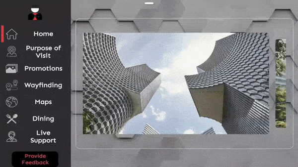

<!-- Heading--->

# TemiConcierge
TemiConcierge is a highly configurable application that utilises temi's capabilities to provide concierge services to users.

Concierge services covered include teleconferencing, directory, promotion & marketing materials plus many more.

## Why should I use TemiConcierge?

Perhaps you operate in a services business that requires assisting guests at the front door with concierge-like services such as guiding guests to locations on your premise, sharing dinning options or ongoing promotions, arranging transportation and answering customer queries

TemiConcierge will be able to fulfill these functionalties at a fraction of a cost of a full-time staff

## Interested to know more? Click below for the full User Guide

 <a href="https://github.com/temideveloper/Rs-App-Guides/blob/master/TemiConcierge/README.md" title="TemiConcierge"> TemiConcierge</a> 

