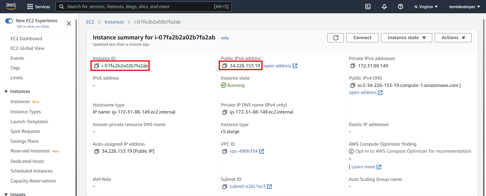

<!-- Heading--->
# TemiEye
<!-- Heading 2 -->
## About
This application is made as a security application for Temi robot with patrolling and live video feed capabilities. 

This application allows users to create routes from locations saved in the Temi robot and patrol the route created. 

- [Configurations](#temi-configurations)
    - [Temi Configurations](#temi-configurations)
    - [App Configurations](#app-configurations)
- [Patrol](#patrol)
    - [Route Creation](#route-creation)
    - [Stop Patrol](#stop-patrol)
    - [Stationary Patrol](#stationary-patrol)
- [Ant Media Server](#ant-media-server)
    - [Quick Start](#quick-start)
    - [View Broadcast Streams](#viewing-streams)
- [Acknowledgements](#acknowledgements)
---
## Temi Configurations
1. Stopping temi from following others 
   > Settings > Tracking User > OFF
2. Removing the display of the next location that Temi is going to
   > Settings > General Settings > Fullscreen navigation notification | Navigation status label > OFF

3. Disabling Interaction Button (Optional)
   > Settings > General Settings > Interaction Button > Disabled

---

## App Configurations

**Set the IP Address of the Ant Media server used for streaming. See [Quick Start](#quick-start) for IP Address to be filled in.**

When attempting to start a patrol, if the patrol does not begin for quite some time, it is likely that there is an issue with the server or the IP address is inputted wrongly. 

App configurations:
- Server IP Address: IP address of Ant Media server where live stream can be accessed and recorded
- App master password - Master password for configuring application settings
---
## Patrol
### Route creation

Tap on the locations to add it to the route

- Patrol Count: Number of times Temi will patrol the route created

- Route: Sequence of locations taken by Temi during the patrol

### Removing a location

Swipe up or down on a inputted location to remove it

### Reordering a location

Hold and drag a location card to change it's position

### Stationary Patrol
To create a stationary patrol, simply leave the Route empty.
Temi will just be stationary and the camera will be activated for the live streaming of video feed. 

### Stop Patrol
Click **6** times anywhere on Temi's screen while it is patrolling to interrupt and stop the current patrol.

---
## Ant Media server

### Setting up Ant Media Server on AWS

Instructions can be found in this [Set Up tutorial](https://www.youtube.com/watch?v=EH6v-yUyzjU), which will walk you through the steps to setting up your own Ant Media Server. 

### Quick Start
1. Start your instance and visit: http://INSTANCE_IP_ADDRESS:5080  
**Replace INSTANCE_IP_ADDRESS with the IP address seen on AWS**

2. Login as:   
Username: **JamesBond**  
Password: **[Your-Instance-Id]**, example of an instance id: "i-0c102b2ab377faf2e"

3. Open a new tab and visit http://INSTANCE_IP_ADDRESS:5080/WebRTCAppEE/index.html  
**Note the stream name below the player**: "stream1"
4. Start publishing and open another tab to visit: http://INSTANCE_IP_ADDRESS:5080 /WebRTCAppEE/play.html?name=[Stream-Name (example: "stream1")]

### Viewing Streams
> All streams can be viewed under APPLICATIONS > WebRTCAppEE

Streams are named after the Temi's nickname, with the Stream Id being the Temi's serial number. Simply click the ▶️ icon to view a Stream

You can locate the respective streams using these 2 identifiers. 

---
## Acknowledgements 
<!-- Heading 3 -->
### Icons and art
- [FontAwesome](www.fontawesome.com)
- [Ouch Free Vector Illustrations](https://www.figma.com/community/file/843472672440914284)
- [Vectors Market](https://www.flaticon.com/)
### Libraries
- [Android Studio](https://developer.android.com/studio/intro)
- [Temi Sdk](https://github.com/robotemi/sdk/wiki)
- [Google Rest API](https://developers.google.com/android)
- [Camera View](https://github.com/natario1/CameraView)
- [Awesome Text Input Layout](https://github.com/anoop44/AwesomeTextInputLayout)
- [Ramotion Fluid Slider](https://github.com/Ramotion/fluid-slider)
- [Flat Dialog](https://github.com/mejdi14/Flat-Dialog-Android)
- [Fading Text View](https://github.com/rosenpin/fading-text-view)
- [Ant Media Server](https://resources.antmedia.io/docs/android-sdk)

---
