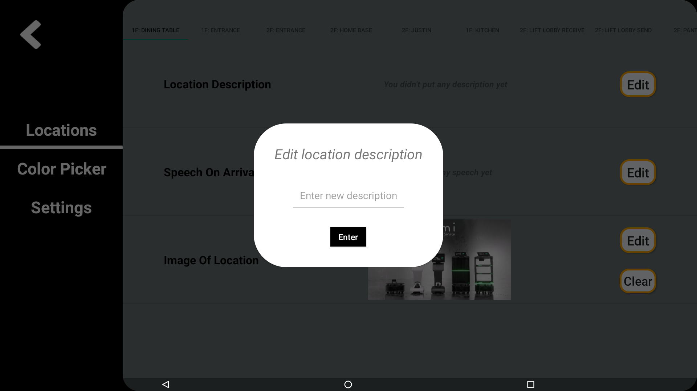

# TemiGo-Delivery (Lift-Autodoor-Turnstile Integration)

## Table of Contents

- [Table of Contents](#table-of-contents)
- [Is there anything I need to do before using TemiGo-Delivery?](#is-there-anything-i-need-to-do-before-using-temigo-delivery)
- [Delivery Mode Screen](#delivery-mode-screen)
- [Travelling Screen](#travelling-screen)
- [Configuration Screen](#configuration-screen)
  - [Locations Settings](#locations-settings)
    - [Location Description](#location-description)
    - [Speech On Arrival](#speech-on-arrival)
    - [Image of Location](#image-of-location)
    - [Copy settings to other locations](#copy-settings-to-other-locations)
  - [Color Picker](#color-picker)
  - [Other Settings](#other-settings)
- [FAQ](#faq)
  - [Creating/Deleting locations](#creatingdeleting-locations)
  - [What is the difference between a speech and description for a location in the app?](#what-is-the-difference-between-a-speech-and-description-for-a-location-in-the-app)
  - [How does the tray system and weight sensors work?](#how-does-the-tray-system-and-weight-sensors-work)
- [Acknowledgements](#acknowledgements)

## Is there anything I need to do to set up TemiGo-Delivery?

1. Turn off the screen that appears when temi is unable to reach a location. (Required)
   > Settings > General Settings > Navigation error notification > OFF

1. Turn off temi's "Tracking User" setting. (Required)
   > Settings > General Settings > Tracking User > OFF

1. Turn off the screen that appears when temi travels to a location. (Preferred)
   > Settings > General Settings > Fullscreen navigation notification > OFF

1. Turn off the green label that appears at the top when temi is navigating. (Optional)
   > Settings > General Settings > Navigation status label > OFF

1. Refrain from navigating around the app using the back button on the left/right of Temi's bottom toolbar.

## Delivery Mode Screen

This screen contains all the locations saved in temiGo, except for special locations that are saved for lift-autodoor-turnstile intergration. 

**Note:** The locations displayed will be sorted by location name, alphabetically. 

Clicking on any of the saved locations will add the location to the column on the right as shown below. 

To remove the location from the route, just click on it on the right column.

You can use the search icon to search for a certain location. You can also alter the floor by pressing the select floor drop down menu. 

**Tip:** When you search for a location, it searches across all floors.

However, before temiGo start to deliver your things, here are a few points to note:

1. **Always** place the things you want to deliver onto the tray first before starting to deliver. Adding to or taking things off the tray can be dangerous as temiGo **will not stop** and wait for you to put the things once it starts moving.
1. temiGo will update the `tray color` as you put or take your things. Use this as an indicator whether temiGo is aware of the items you placed into it's tray.
1. At least 1 and at most 3 locations can be picked to start delivering.
1. Each location added correspond to a tray (tray 1 for location 1, tray 2 for location 2, tray 3 for location 3) 

You can now click on the `Start Delivery` button and temi will proceed to [Travelling Screen](#travelling-screen) and deliver your things.

On the top right corner, there are 3 buttons. They are, from left to right, `Setting`, `Follow Me`, and `Stop` buttons.

Selecting the `Setting` button will bring you to the [Configuration Screen](#configuration-screen).

Alternatively, you can click on `Follow Me` button on the top right corner, and temiGo will follow wherever you go. You can click on the `Stop` button to stop temiGo from following you.

## Travelling Screen

You will see this page when temiGo is moving to a selected location.

When it arrives, it will play the arrival speech. This can be changed (whether temi speaks or not and what is speaks) in [Locations Settings](#locations-settings).

There are 4 buttons at the bottom that you can click on, even when temiGo is moving. They are there for you to click in case you want to cancel the delivery, or want to stop temi to load/remove stuff.

`Prev Page` button will bring you back to [Delivery Mode Screen](#delivery-mode-screen).

`Return` button will change temiGo's destination to the `home location`. By default, `home location` is `Home Base`, but it can be changed in [Other Settings](#other-settings).

`Stop` button will just stop temiGo's movement.

`Continue` button will continue the delivery.

- If the robot is on its way to location 1
   - If the first tray is loaded, it will carry on to the firs location 
   - If the first tray is not loaded, it will skip the first locatio and go to the second location (or go home if there is no second location)
- If the robot is at location 1, then it will continue going to location 2.

**Note**: To avoid misclicks, `Continue`, `Prev Page` and `Return` buttons are only enabled when temiGo stops moving, you can use the `Stop` button to achieve this. Furthermore, `Prev Page` and `Return` buttons requires you to long press on them to enable.

## Going Home Screen 
Similar to the travelling screen, this screen is displayed once all deliveries have been completed and temiGO is going back to standby location wwhich can be changed in [Other Settings](#other-settings) 

## Configuration Screen

Before anything, you will need to enter your password first. By default the password is `Robosolutions`, note the capital `R`. The password can be changed in [Other Settings](#other-settings) later on.

### Locations Settings

This screen is where configurations for locations are done.

Images below shows how the dialog looks like for updating the respective fields.

#### Location Description

#### Speech On Arrival

#### Image of Location

**Note**: you will need to give the app access to your photo and media, only on the first time.

You can then access the device's local storage to find the image you want.

Alternatively, if `Doogle Drive` is installed and logged in, you can also pick image from your `Doogle Drive`.

| Where to choose Google Drive | Google Drive Main Page |
| --- | --- |
|  |  |

**Note**: you can click on the `Clear` button to reset the picture to nothing.

#### Copy settings to other locations

For the 3 settings above, after you click `Save`, there will be a dialog that will ask you if you wish to copy the settings over to other locations. This is convinent if you wish to, for example, set the same speech for many locations without typing them over and over again.

### Color Picker

You can change the color of the trays and strip freely here.

The `Set To This Color` button serves as a preview for the color you currently picked, as well as a confirmation button to update the color.

The `Reset Colors` button allows you to switch back to default colors.

### Other Settings

**Note**: You will see this screen for the first time you run this application. Please click on `Allow` so the application has the permissions to update the settings.

This screen is where other configuration settings are done.

| Page 1 | Page 2 |
| --- | --- |
|  |  |

As a quick summary, here's the things that can be changed:

1. Password to enter [Configuration Screen](#configuration-screen)
1. Does it announce speech on arrival
1. Does it announce description on arrival (after speech)
1. Home location it returns to
1. The duration temiGo will wait at each location before moving on to the next location
1. Volumn
1. Recalibrate trays' weight detection
1. Current LCD text on small LCD (screen behind temiGO)

## FAQ

### Creating/Deleting locations

Locations in the app reflect the locations saved in temi. As such, adding/deleting locations in the app can be done only by adding/deleting locations stored in temi respectively. Once you have re-entered the app after adding/deleting a location, changes should be reflected in the [Delivery Mode Screen](#delivery-mode-screen). If not, you can refresh the screen by minimizing and re-entering the app again.

### What is the difference between a speech and description for a location in the app?

Descriptions appear at the bottom of the location card in the Delivery Locations screen. 

Both speech and description for a location can be announced, but only the description for a location will be shown in the locations screen. If both speech and description are to be announced, the speech will be announced before the description.

### How does the tray system and weight sensors work?

Each Tray is tied to a destination. Hence, only 3 destinations are supported in the weight sensor version. First destination is tied to first tray etc. 

If the weight sensor is loaded when temiGO reaches the first destination, temiGO will wait at the location until the tray is emptied or until the timeout runs out, whichever comes first. Note that the timeout will be decreased to 10 seconds after the tray has been emptied. 

## Acknowledgements

Icons made by [wanicon](https://www.flaticon.com/) and [Freepik](https://www.flaticon.com/)
