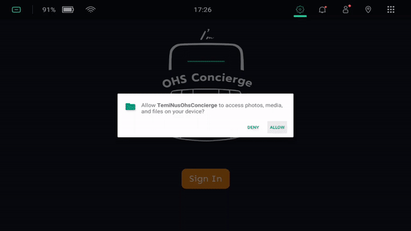

<!-- Heading--->

# TemiOhsConcierge
<!-- Heading 2 -->
## About
Concierge Application for NUS Office of Housing Services

---
## Temi Configurations
1. Configuration to allow Temi to greet users 
   > Settings > Tracking User > ON
2. Disabling Interaction Button (Optional)
   > Settings > General Settings > Interaction Button > Disabled

---

## Sign In

Google Drive account that will be associated with the application [Used for downloading Image and Video resources]

## App Configurations
**To enter the configurations page (after logging in), click on the App Logo 7 times**

> ***Contact Robosolutions at +(65) 8303 2264 for the Default Password***

### General Tab
**Import default assets by clicking on the 'Add All Default Resources' button**

- App password: Password to enter the configurations page
- Greeting Message: Message broadcasted when Temi detects someone infront
- Survey QR Link: QR Code when the Provide Feedback button is selected
- Home slides: Image slides that are displayed in the home tab

### Personnel Tab
Page to manage which associated device to call and whether it is shown in the 'Call Us' tab in the home page.

- To change the display name, edit the profile name associated with your Temi Account

- The device to be called is the one that is highlighted in red

- To show that the contact is shown in the main page, toggle the show button to the green state

### Directions Tab
Page to manage locations shown in the 'Directions Tab' in the home page.

Each direction resource contains:
- Title: Name of the location that will later be displayed on the location card
- Preview image: Image shown on the card 
- Slides: Sequence of images that are shown when the location card is selected in the home page

Editing slides (Upon adding the relevant image resources):
1. Reordering slide: Select and hold down on the slide that you would like to reorder, then drag the slide up or down to reorder
2. Deleting slide: Swipe the slide left or right to remove an image from the slides

### Questions Tab
Questions that will be shown in the 'FAQ Tab' in the main page

Each question resource contains:
- Category: Questions of the same category will be grouped together in the FAQ Page
- Question
- Narration: Message to be broadcasted when the question is selected
- Answer image: Image flashed when a question is selected

### Resources Tab
Management page for importing resources from the associated Google Drive account as well as managing the videos shown in the 'Gallery Tab' in the main page

Each concierge resource contains:
- Title: Title of the card that is shown in the Gallery Page
- Question
- Preview Image: Image shown on the card 
- Video Resource: Video played when the gallery card is selected

## Main Page
### Home Tab
Slideshow that changes every 5 seconds

### Gallery Tab

Displays Video Cards that will play a video

### Call Us Tab
Allows users to make calls through Temi (requires Temi Service Center on Desktop OR Temi App on Mobile on OHS's side) 

### Directions Tab
- Direction cards: Each card contains a slideshow that directs people to a certain destination 

- Taxi: Dialog that shows a QR Code to download Grab as well as Comfort Delgro's Hotline
- Where we are: A dialog that shows a map of Kent Vale
- Interactive Map

### FAQ Tab

---
## Acknowledgements 
<!-- Heading 3 -->
### Icons and art
- [FontAwesome](https://lottiefiles.com/)
- [Lottie Animations](https://www.figma.com/community/file/843472672440914284)
    - [Home Animation](https://lottiefiles.com/49921-home)
    - [Gallery Animation](https://lottiefiles.com/53731-video-camera)
    - [Call Us Animation](https://lottiefiles.com/16689-phone-call)
    - [Directions Animation](https://lottiefiles.com/17314-bus)
    - [FAQ Animation](https://lottiefiles.com/25920-questions)
### Libraries
- [Android Studio](https://developer.android.com/studio/intro)
- [Temi Sdk](https://github.com/robotemi/sdk/wiki)
- [Google Rest API](https://developers.google.com/android)
- [Awesome Text Input Layout](https://github.com/anoop44/AwesomeTextInputLayout)
- [Room](https://developer.android.com/training/data-storage/room)
- [Media2](https://developer.android.com/jetpack/androidx/releases/media2)
- [Glide](https://github.com/bumptech/glide)
- [Wasabeef Glide Transformations](https://github.com/wasabeef/glide-transformations)
- [Rounded Image View](https://github.com/vinc3m1/RoundedImageView)
- [Lottie - Android](https://github.com/airbnb/lottie-android/)
- [Android Spin Kit](https://github.com/ybq/Android-SpinKit)
- [Photoview for zooming](https://github.com/Baseflow/PhotoView)
---