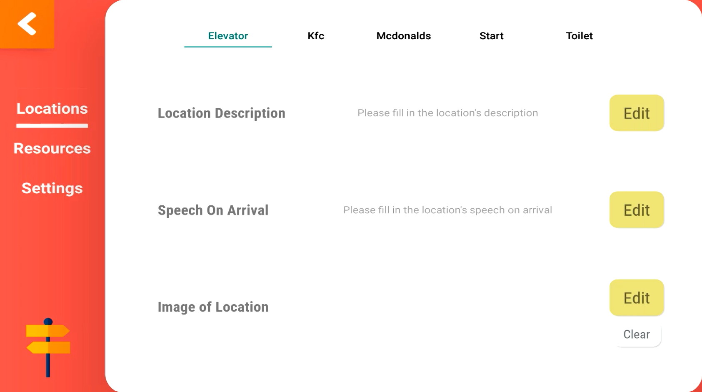

# TemiWayFinder
TemiWayFinder is a versatile application used for wayfinding purposes. It will direct users to a location before automtically returning to the start position

Locations captured using Temi's internal mapping are displayed inside this app and they can be configured to announce speeches upon arrival at each location. Temi will then be programmed to move back to the location named "Start" after arriving at the destination

## Why should I use TemiWayFinder?

Perhaps you are a business owner and you would like to offer visitors who enter your physical store/facility a service that can bring them
to a location of their choice? TemiWayFinder allows you to add a description and an image to a location saved in temi, so that
visitors have a better idea of where to go, and they can select that location for temi to escort them there.

## Is there anything I need to do before using TemiWayFinder?
1. Turn off the screen that appears when temi travels to a location
   > Settings > General Settings > Fullscreen navigation notification > OFF

2. Turn off temi's "Tracking User" setting
   > Settings > General Settings > Tracking User > OFF  

3. Turn off the green label that appears at the top when temi is navigating (Optional)
   > Settings > General Settings > Navigation status label > OFF
   
4. Refrain from navigating around the app using the back button on the left/right of Temi's bottom toolbar.

5. Use Temi mapping feature to save a location and name it as **start**. This location is required as Temi will return to this location after arriving at the destination. 

# Overview

## "Sign In" screen
The Google account selected will be added to TemiWayFinder, where you can import images from. 

## "Locations" screen
This screen is where all the locations in TemiWayFinder resides. Each location on this screen displays their image (if present)
as well as their description. Clicking on a location will make Temi navigate to the selected location. Upon arrival, Temi will wait for 10 seconds
and before announcing "We have reached the destination. I'll be heading back now" and then returning back to the **Start** position  
 

"Location items" in the screen can be shown in 1 row (default) or 2 rows, which can be set in the "Configuration" screen.  
These items can be reordered for your convenience. To do that, make sure the "Sort by alphabet" button is not selected **(Selected - Green, Not Selected - White)**.

Long press on the item you want to reorder until the item becomes partially transparent, and drag it to where you would like its new position to be, and release your finger
to drop the item in its new position. 

**Tip**: Dragging and dropping the "location items" **does NOT swap** the items, but rather it places all other items that it has displaced either in front or behind
the dragged item.

Selecting the "Sort by Alphabet" button will sort the location items by their location name alphabetically. 

Clicking on a "location item" will cause Temi to navigate to the mapped location saved under the same name. (Please see Temi's "Locations" option if unsure)

## "Configuration" screen
This screen is where all configuration in TemiWayFinder is done. Click the Temi Announcer logo **3** times in any of the non-configuration screens
after signing in, and enter the configuration password to access the screen

### Default Configuration Password
The default configuration password is "**Robosolutions**".  To change the password, please see [this](#changing-configuration-password).

# User Guide - Locations
* [Creating/Deleting locations](#creatingdeleting-locations)
* [Adding an image to a location](#adding-an-image-to-a-location)
* [Adding speech/description to a location](#adding-speechdescription-to-a-location)
* [Reorder locations in screen](#reorder-locations-in-screen)

# User Guide - Configuration
* [Saving images into the app](#save-images-into-the-app)
* [Show more locations in the "Locations" screen](#show-more-locations-in-the-locations-screen)
* [Modifying time taken before temi moves to next location in route](#modifying-time-taken-before-temi-moves-to-next-location-in-route)
* [Changing configuration password](#changing-configuration-password)

# FAQ

## Creating/Deleting locations
Locations in the app reflect the locations saved in temi. As such, adding/deleting locations in the app can be done only
by adding/deleting locations stored in temi respectively. Once you have re-entered the app after creating/deleting a location,
changes should be reflected in the "Locations" screen. If not, press the refresh button at the top-left corner of the "Locations" screen

## Adding an image to a location
In the "Configuration" screen, click the desired location that you wish to edit at the top, and then click the **"Edit"** button under the **"Image of Location"** 
section. If the screen (dialog) that opens does not show any images/you will have to [save images into the app](#save-images-into-the-app). 
 
 

## Adding speech/description to a location
In the "Configuration" screen, click the desired location that you wish to edit at the top, and then click the **"Edit"** button under the appropriate section.

## Reorder locations in screen
In the "Locations" screen, you can drag and drop a location item to reorder them as you like. Press the desired location item until it turns more transparent,
drag it to the location item you would like to switch with, and release your finger from the screen. Learn more [here](#locations-screen).

## Save images into the app
Under the "Configuration" screen, select the "Resources" tab on the left. 
 
Click the green button at the center top, and a dialog will appear. From there, you can choose where to import your images (into the app) from.  

## Changing configuration password
Under the "Configuration" screen, select the "Settings" tab on the left, then under "Others", click the "Edit" button of the "Configuration Password" section to be
brought to a dialog to change your password. 

## Issues
* App might exit when touching its interaction button when trying to stop its execution of a route. This might happen only when doing such an action for the
first time after installing the app, but it will not happen again.

## Acknowledgements
### Icons

Icons made by <a href="" title="wanicon">wanicon</a> from <a href="https://www.flaticon.com/" title="Flaticon">www.flaticon.com</a>

Icons made by <a href="https://www.freepik.com" title="Freepik">Freepik</a> from <a href="https://www.flaticon.com/" title="Flaticon">www.flaticon.com</a>

