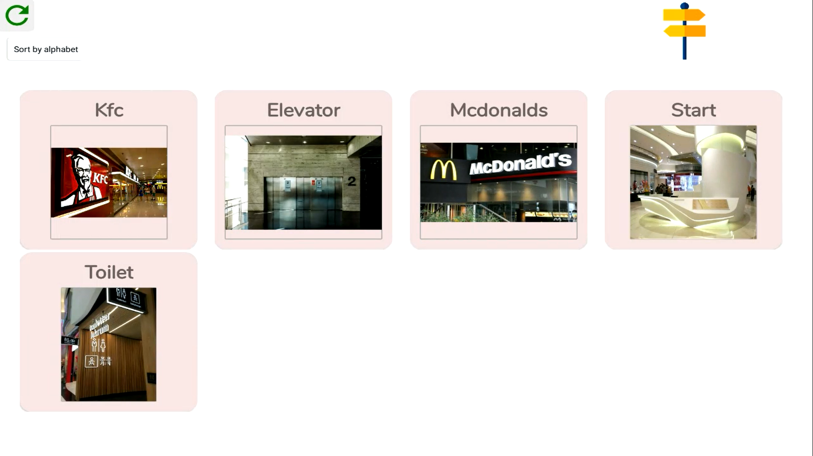

# TemiWayFinder
TemiWayFinder is an application used for Wayfinding purposes. It will direct users to a location before automtically returning to a central position after 10 seconds

Locations captured using Temi's internal mapping are displayed inside this app and they can be configured to announce speeches upon 
arrival at each location. Temi will then be programmed to move back the location named "Start" after arriving at the destination

## Why should I use TemiWayFinder?

Perhaps you are a business owner and you would like to offer visitors who enter your physical store/facility a service that can bring them
to a location of their choice? TemiWayFinder allows you to add a description and an image to a location saved in temi, so that
visitors have a better idea of where to go, and they can select that location for temi to escort them there.

## Interested to know more? Click below for the full User Guide

 <a href="https://github.com/temideveloper/Rs-App-Guides/blob/master/TemiWayFinder/README.md" title="TemiWayFinder"> TemiWayFinder</a> 

