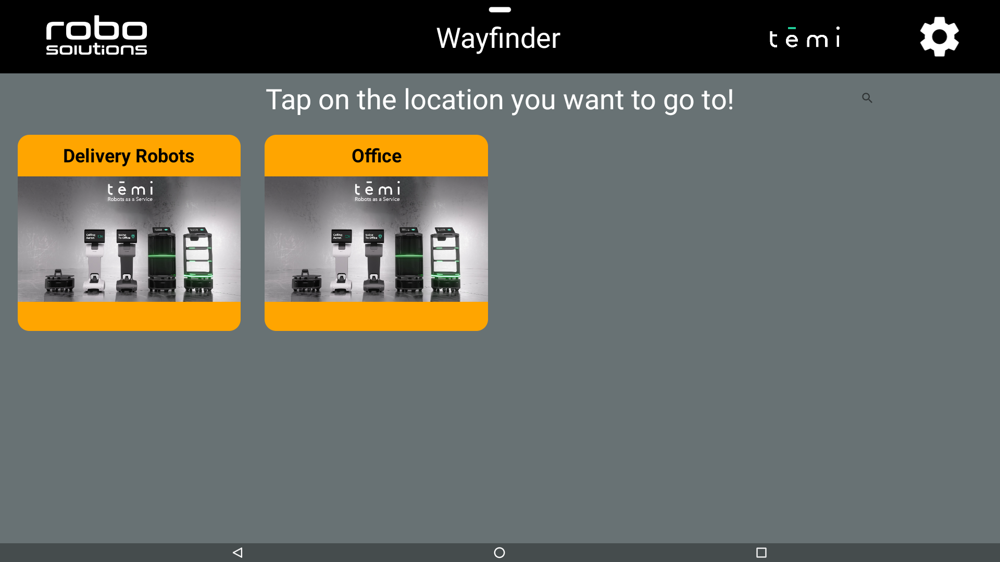
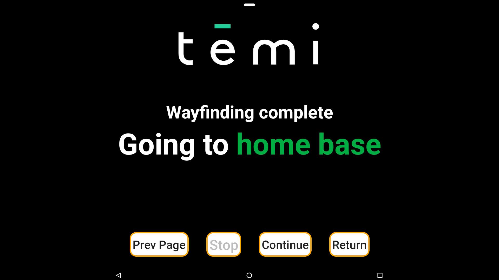
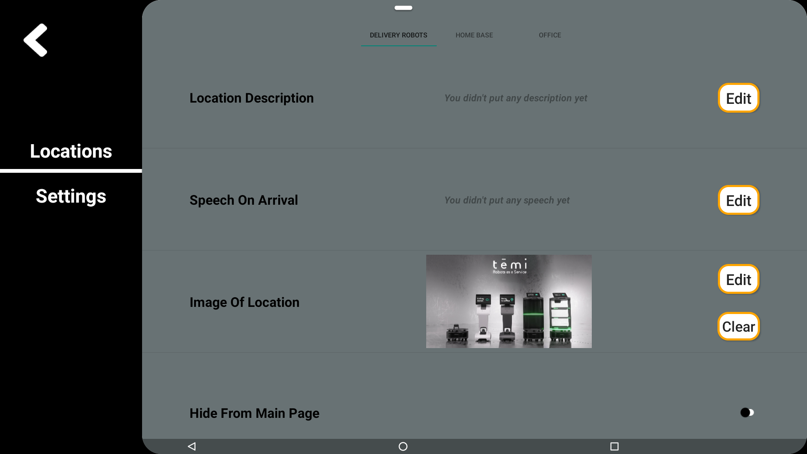
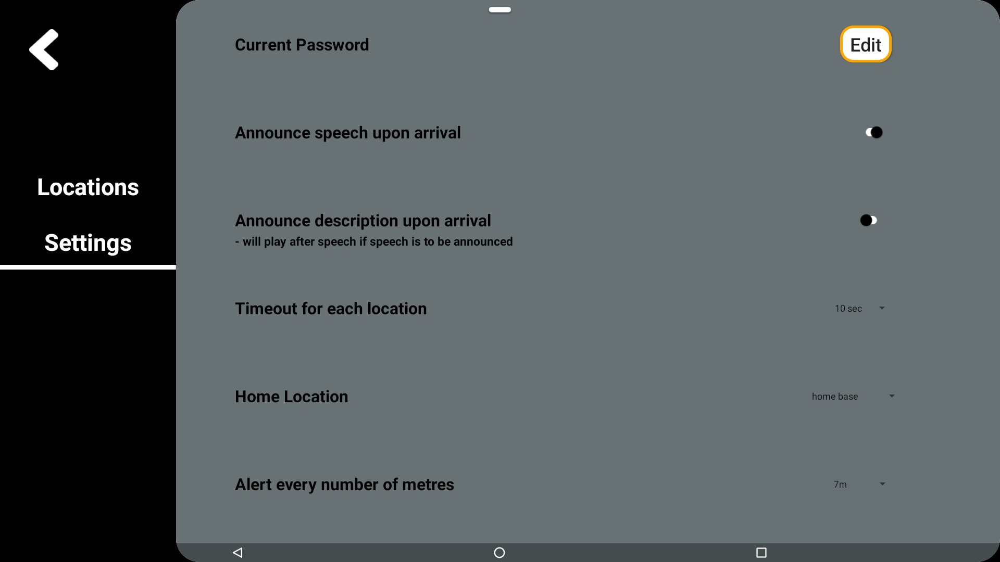

# TemiWayFinderV2
TemiWayFinderV2 is a versatile application used for wayfinding purposes. It will direct users to a location before automtically returning to the start position

Locations captured using Temi's internal mapping are displayed inside this app and they can be configured to announce speeches upon arrival at each location. Temi will then be programmed to move back to the location named "Start" after arriving at the destination

## Why should I use TemiWayFinderV2?

Perhaps you are a business owner and you would like to offer visitors who enter your physical store/facility a service that can bring them
to a location of their choice? TemiWayFinderV2 allows you to add a description and an image to a location saved in temi, so that
visitors have a better idea of where to go, and they can select that location for temi to escort them there.

## Is there anything I need to do before using TemiWayFinderV2?
1. Turn off the screen that appears when temi travels to a location
   > Settings > General Settings > Fullscreen navigation notification > OFF

2. Turn off temi's "Tracking User" setting
   > Settings > General Settings > Tracking User > OFF  

3. Turn off the green label that appears at the top when temi is navigating (Optional)
   > Settings > General Settings > Navigation status label > OFF
   
4. Refrain from navigating around the app using the back button on the left/right of Temi's bottom toolbar.

# Overview

## "Locations" screen
This screen is where all the locations in TemiWayFinderV2 resides. Each location on this screen displays their image (if present)
as well as their description. Clicking on a location will make Temi navigate to the selected location. Upon arrival, Temi will wait for 15 seconds (Configurable in settings)
and before announcing "We have reached the destination. I'll be heading back now" and then returning back to the **Start** position  
 

"Location items" in the screen are automatically ordered based on their names, in increasing alphabetical order. 

Clicking on a "location item" will cause Temi to navigate to the mapped location saved under the same name.

Follow Me Button: Use this button to get temi to follow you around while in the application. Clicking it will change the button to "Unfollow", which will stop temi upon pressing again. 

Force Stop Button: Use this button to stop temi when temi is moving. (this button is for emergency purposes and is not used in normal operation)

**Note** that the two screens below will be shown when temi is moving from one point to the other. 

## "Settings" screen
This screen is where all settings in TemiWayFinderV2 is done. Click the TemiWayFinderV2 logo **3** times in any of the non-settings screens
after signing in, and enter the settings password to access the screen

### Default Settings Password
The default settings password is "**Robosolutions**".  To change the password, please see [this](#changing-settings-password).

### temi App List
From any settings screen, clicking TemiWayFinderV2 logo again exits the app and navigates back to temi's App List. 

# FAQ

## Creating/Deleting locations
Locations in the app reflect the locations saved in temi. As such, adding/deleting locations in the app can be done only
by adding/deleting locations stored in temi respectively. Once you have re-entered the app after creating/deleting a location,
changes should be reflected in the "Locations" screen. 

## Adding an image to a location
In the "settings" screen, click the desired location that you wish to edit at the top, and then click the **"Edit"** button under the **"Image of Location"** 
section. 

## Adding speech/description to a location
In the "settings" screen, click the desired location that you wish to edit at the top, and then click the **"Edit"** button under the appropriate section.

## Changing settings password
Under the "settings" screen, select the "Settings" tab on the left, then under "Others", click the "Edit" button of the "settings Password" section to be
brought to a dialog to change your password. 

## Acknowledgements
### Icons

Icons made by <a href="" title="wanicon">wanicon</a> from <a href="https://www.flaticon.com/" title="Flaticon">www.flaticon.com</a>

Icons made by <a href="https://www.freepik.com" title="Freepik">Freepik</a> from <a href="https://www.flaticon.com/" title="Flaticon">www.flaticon.com</a>

