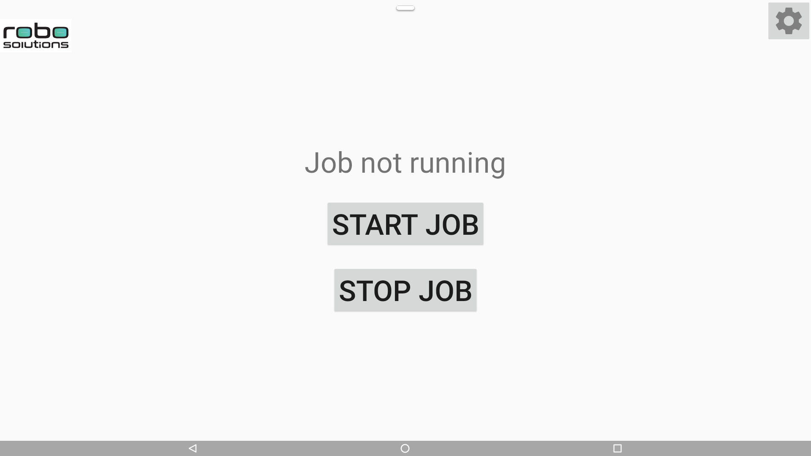
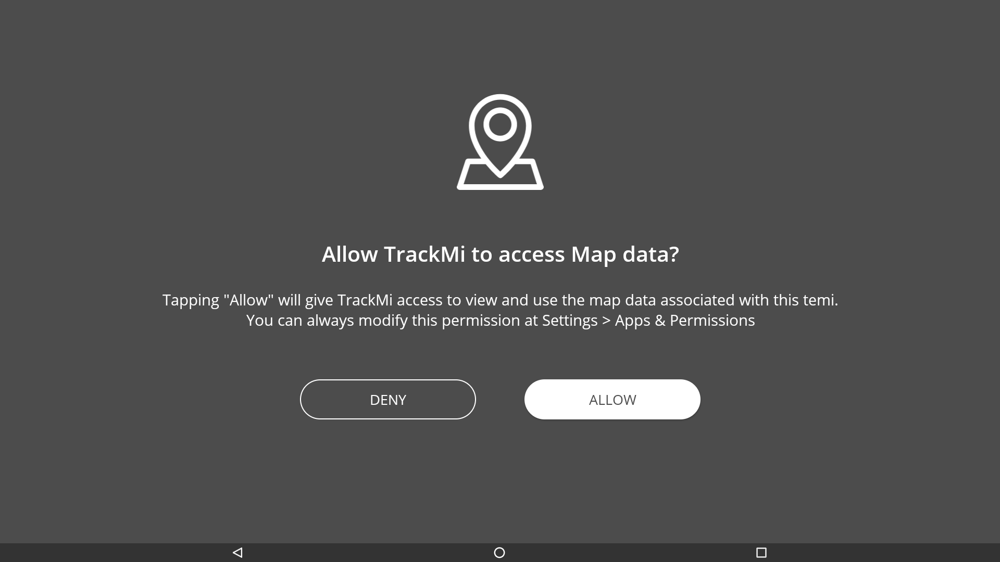
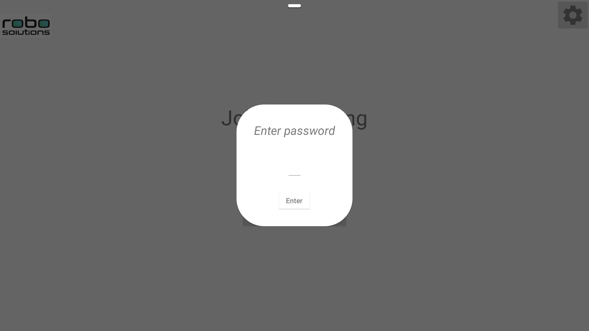
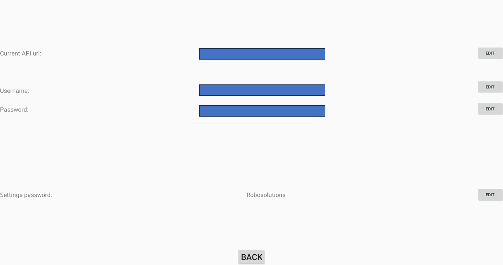
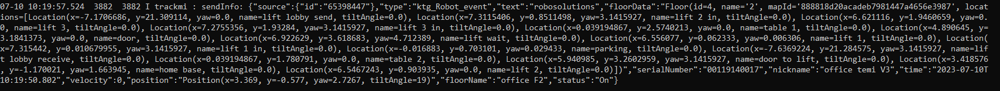
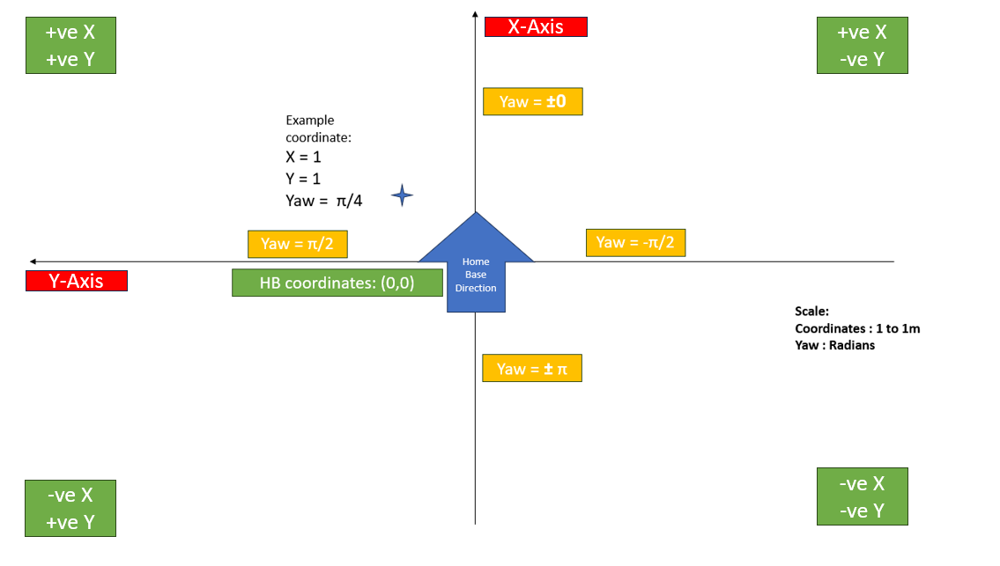

# TrackMi

## Main Screen

The first line shows whether the application is running or not.

You can click on the `Start Job` button to start and the `Stop Job` button to stop it.

When the job is started, the first line will show `Job running`. 

When the job is stopped, the first line wil lshow  `Job not running`. 

Note: 
1. For the first time, when clicking on the `Start Job` button, the application will ask for `Map` permission. This is required for floor data. 
    - The application will still work if the permission is not given, but some data may be `null` (and `null` data will not be send over so they will be missing) when sending over.
    - You can manually give map permission by going to temi settings -> Apps & Permissions -> Permissions -> Map -> Trackmi -> On  
2. Please allow some time (up to 10 seconds) after pressing stop job for the job to stop and the text to switch to `Job not running`.
    - If the stop job button is repeatedly pressed before `Job not running` appears, a message stating `TrackMi is not responding` may be displayed. Pressing `wait` will close the message and allow the app to continue running.  

## Settings page
To access the settings page, press the icon located in the top right corner of the start page. A prompt asking for settings page password will be displayed. 

The default password is `Robosolutions`. This can be edited in the settings page. 

There are 4 editable fields in the settings page. 

When the API endpoint is changed, these 3 fields need to be edited with the new configuration. API url is the link to send the data to. Username and password is the authentication for accessing the API link. 
* API URL 
* Username 
* Password

Settings password can also be configured by pressing the edit button. 

Note that an empty password field is a valid password. 

## Interpreting the data received 

Here is an example of the data that is sent. 

Here is an example image of how the map is orientated. More information can be found [below](#Notes). 

### Notes 

* Coordinate of home base is `x=0` and `y=0`. However, the robot may send very slight variations due to the way the robot is docked in the home base.
* The X-axis extends in the direction the home base is facing and the Y-axis extends to the left of the direction the home base is facing. 
    - Note that this means the right of the direction the home base is facing is considered the negative y direction. Likewise, anything behind the home base is considered to have negative x direction. 
* The `scale` of the axis is `1 to 1 metre`. (i.e. an increase from x=0 to x=1) indicates that the robot has moved 1metre in the direction the home base is facing. 
* The `yaw` field indicates the direction that the robot is currently facing. The range of values is [-π, π]. Turning clockwise is negative while turning anti-clockwise is positive. 
* The `tilt angle` field indicates the angle of the screen. The range of values is [-25, 55] in degrees. 
